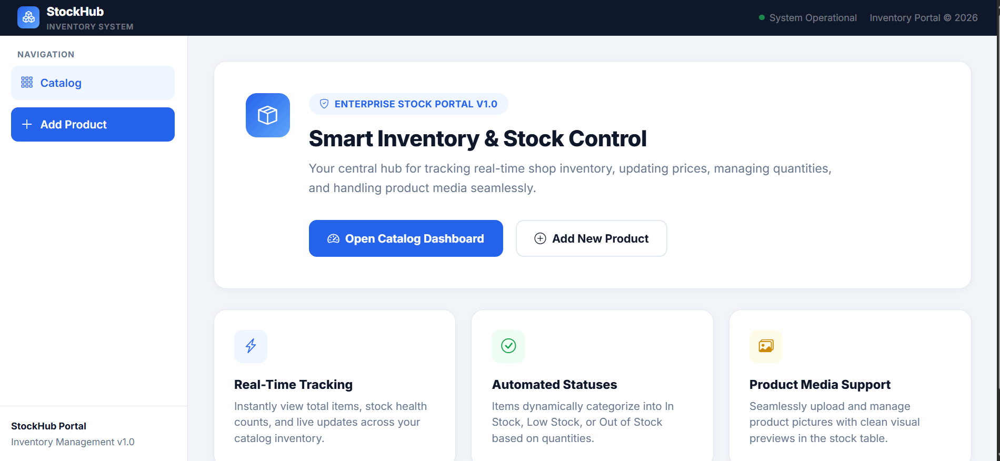
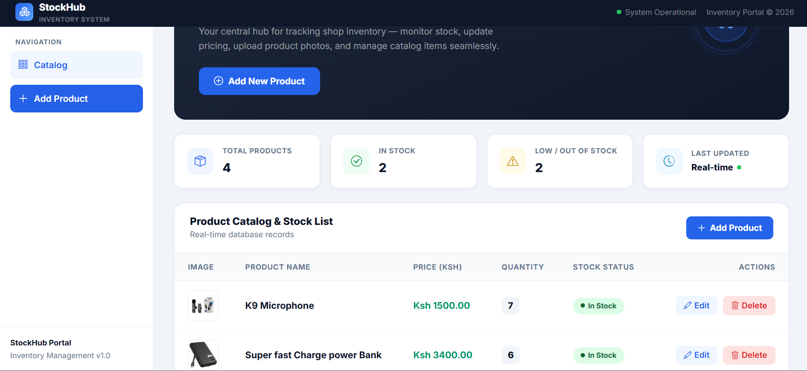
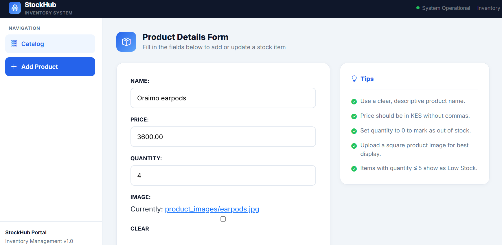

# 📦 StockHub Enterprise Portal (Stock Management System)

A modern, full-featured web application built with **Django** and **Bootstrap** designed to streamline inventory tracking, product catalog management, stock health monitoring, and media handling for businesses.

---

## 🚀 Tech Stack
* **Backend:** Python, Django MVT Architecture
* **Frontend:** HTML5, CSS3, Custom UI Components, Bootstrap Icons
* **Database:** SQLite (Development) / PostgreSQL compatible
* **Styling:** Custom modern color palettes, responsive CSS grid layout, and smooth animations

---

## 🖥️ Pages & UI Walkthrough

### 1. Landing Page (Welcome Hub)
The root URL (`/`) features a clean, responsive welcome dashboard that introduces users to the system with quick actions to jump straight into the catalog or add new stock items.
* **Key Features:** Enterprise overview, real-time tracking highlights, and call-to-action buttons.

### 2. Inventory Catalog Dashboard
Located at `/catalog/`, this view lists all available stock items in a structured table complete with product preview images, item names, pricing in KES, quantities, and automated status tags.
* **Key Features:** Dynamic stock status labels (*In Stock*, *Low Stock*, *Out of Stock*), edit and delete actions, and search/filter integration.

### 3. Product Details Form (Add / Update)
A split-layout form view designed for entering or modifying product details seamlessly alongside a helpful tip panel.
* **Key Features:** File upload support for product images, sleek input focus states, and quick navigation back to the dashboard.

---